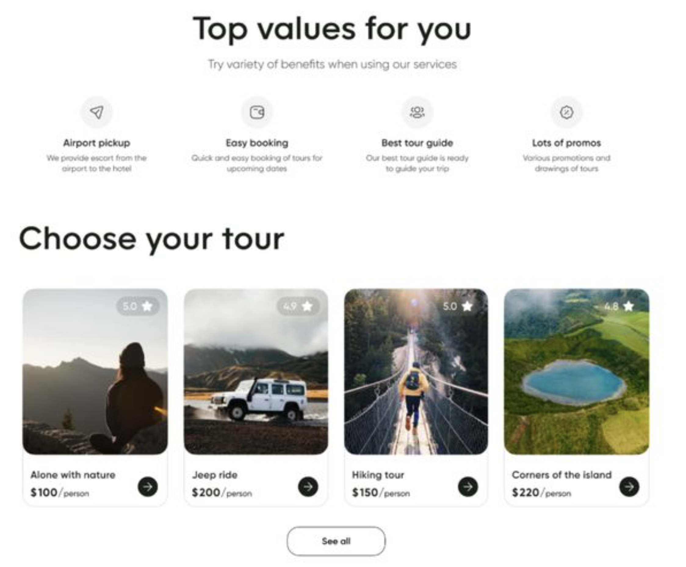

# Semana 7 - Sesion 2: CSS Framework BOOTSTRAP

## Que es un Framework de CSS
Es un conjunto de herramientas que pretenden encapsular las tareas repetitivas en módulos genéricos o componente para que sean fácilmente reutilizables.

La presente tarea trata de realizar a cabo la maquetación y diseño del siguiente landing page utilizando bootstrap

### Division de la página
La pagina se encuentra dividida en 3 secciones: header, main y footer
1. Para el header se utilizó la clase "row" de bootstrap y creamos una columna (col) de todo el espacio disponible (12).
2. En el main se han creado 2 articles 
    1. El primer article cuenta con sections con las clases `col-12 col-lg-3` para abarcar el diseño responsive. Adicionalmente, se hace uso de la libreria de iconos de bootstrap. Cada uno de los section esta conformado por un icon, un h5 y un p.
    2. El segundo article lleva una division por sections donde ira cada tour ofrecido. Estos section usaran la clase de display flex de bootstrap `mt-2 d-flex align-items-center justify-content-between`. Las imagenes utilizadas se encuentran en el directorio `./img`. Se adecuo el uso del componente card para la realización de las tarjetas
3. Una hoja de estilos adicional para añadir estilos complementarios `styles.css` a los proporciodos por bootstrap.
4. El footer cuenta con los derechos de autor y una serie de links con iconos para las redes sociales utilizando las siguientes clases `mt-4  bg-black text-white d-flex flex-column justify-content-center p-3`

